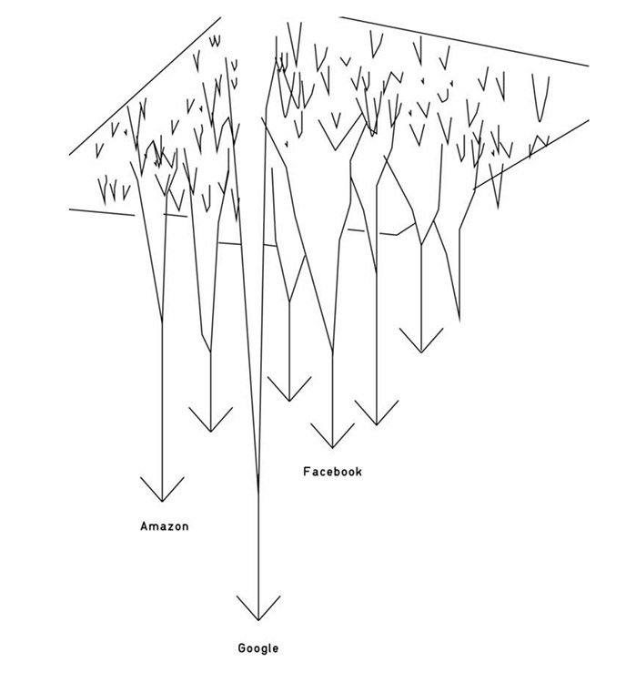
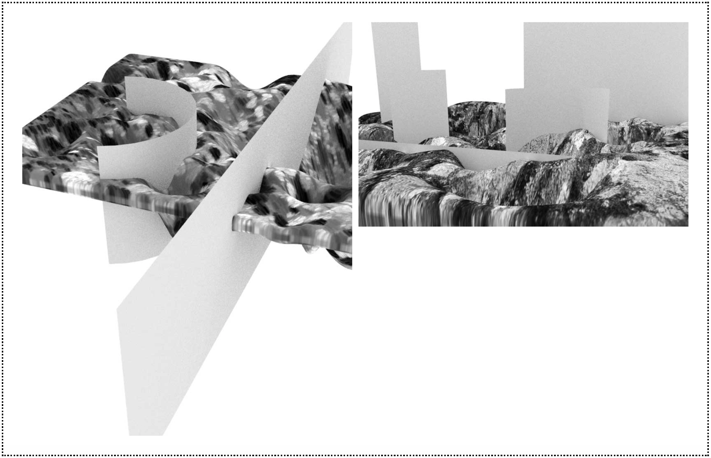
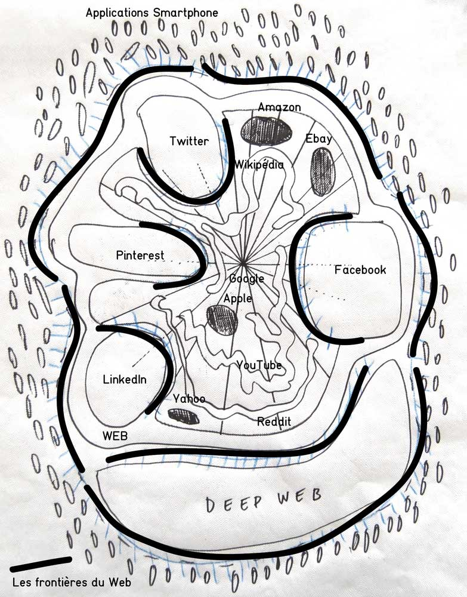
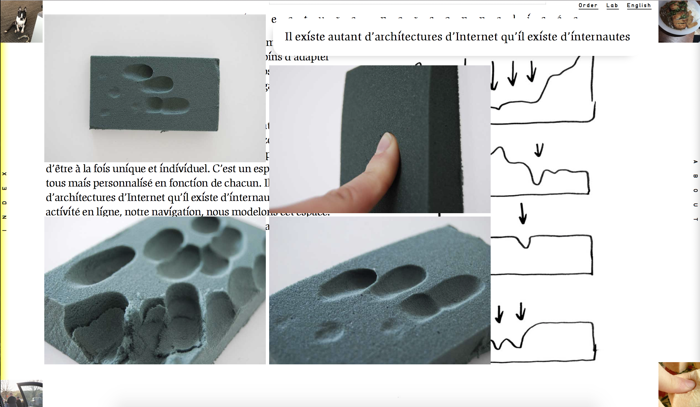
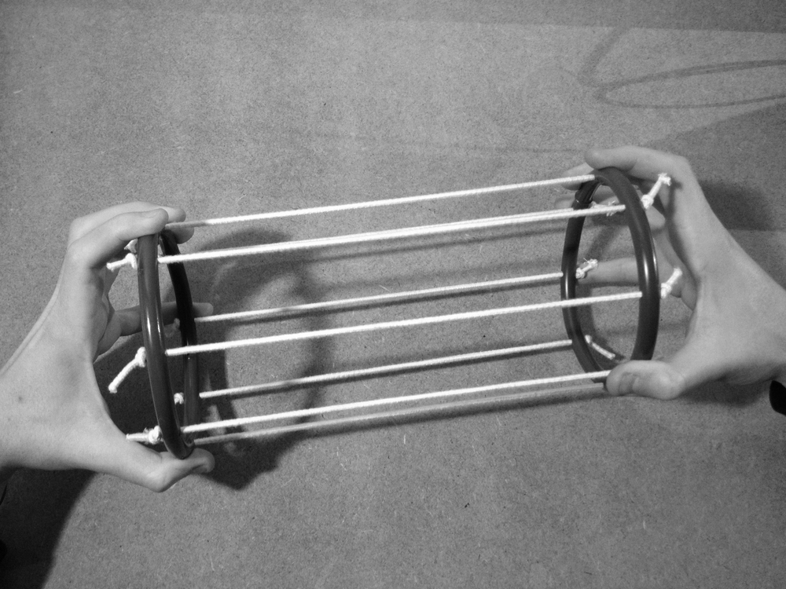
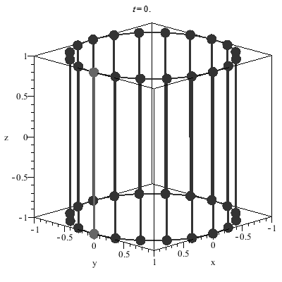
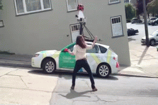
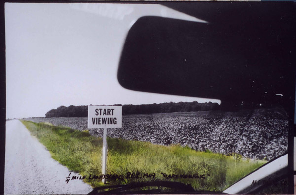
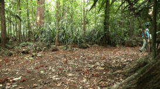

<!-- .slide: data-background-image="img/mercator.jpg" -->
<!-- .slide: class="hover"-->

## Post-_Weltbild_. Cartographier le monde après le numérique

### Enrico Agostini-Marchese    &    Christelle Proulx
 
Conférenciers invités
 
Colloque "Post-médium?" HAR6150 - Hiver 2018
 
 
Montréal - 19 avril 2018

<!-- .element: style="font-size:1.4rem" -->

 <!-- .element: class="logo" -->

%%%%%%%%%%%%%%%%%%%%%%%%%%%%%%%%%%%%%%%%%%%%%
<!-- .slide: class="hover"-->
##### Résumé du débat pour le choix du sujet

§§§§§§§§§§§§§§§§§§§§§§§§§§§§§§§§§§§§§§§§§§§§§
<iframe width="760" height="550" src="https://www.youtube.com/embed/LybAHotsvOg" frameborder="0" allow="autoplay; encrypted-media" allowfullscreen></iframe>
%%%%%%%%%%%%%%%%%%%%%%%%%%%%%%%%%%%%%%%%%%%%%
<!-- .slide: data-background-image="img/PLA160.GIF" data-background-size="contain"-->
<!-- .slide: class="hover"-->

## Weltbild

- Image du monde
- Vision du monde, conception du monde
- Heidegger, _Chemins qui mènent nulle part_ :
  - Essence de la modernité :  « ce qui caractérise et distingue le règne des Temps Modernes »
  - Monde : ensemble de toutes les choses qui existent
  - Image : reproduction de quelque chose
§§§§§§§§§§§§§§§§§§§§§§§§§§§§§§§§§§§§§§§§§§§§§
<!-- .slide: data-background-image="img/PLA160.GIF" data-background-size="contain" -->
<!-- .slide: class="hover"-->
## Weltbild

> « nous le tenions devant nous [le monde], en tout ce qui relève de lui, en tout ce en quoi il consiste, comme système. [...] Là où le Monde devient image conçue, la totalité de l'étant est comprise et fixée comme ce sur quoi l'homme peut s'orienter, comme ce qu'il veut par conséquent amener et avoir devant soi, aspirant ainsi à l'arrêter, dans un sens décisif, en une représentation. »

Martin Heidegger, _Chemins qui mènent nulle part_

<!-- .element: class="source" -->
§§§§§§§§§§§§§§§§§§§§§§§§§§§§§§§§§§§§§§§§§§§§§
<!-- .slide: data-background-video="video/Netarts _ Chatonsky.mp4" data-background-video-loop="loop" data-background-size="cover"-->
<!-- .slide: class="hover"-->
### Post-image-du-monde, post-numérique

- Entrelacement de l'espace tangible et de l'espace en ligne
- Post-numérique
  - Gregory Chatonsky : « après l’Internet, c’est quand le réseau nous entoure de toutes parts et constitue notre quotidienneté »
- Cartographier après le numérique :
    - Cartographier l’internet
    - Cartographier le monde

  Source video : © Gregory Chatonsky, _Netarts_

  <!-- .element: class="source" -->
§§§§§§§§§§§§§§§§§§§§§§§§§§§§§§§§§§§§§§§§§§§§§
<!-- .slide: data-background-image="img/boettiMappe.jpg" data-background-size="contain"-->
<!-- .slide: class="hover"-->

### Deux atlas contemporains

- Louise Drülhe, _Critical Atlas of Internet_
- Google Street View
%%%%%%%%%%%%%%%%%%%%%%%%%%%%%%%%%%%%%%%%%%%%%
<!-- .slide: data-background-image="img/atlas.jpg" data-background-size="contain"-->
<!-- .slide: class="hover"-->
## Atlas

- XVIe siècle, Gerhard Mercator
- XIXe siècle, Changement de paradigme (cit.)
- XXe siècle, Aby Warburg
§§§§§§§§§§§§§§§§§§§§§§§§§§§§§§§§§§§§§§§§§§§§§
<!-- .slide: data-background-image="img/bild.jpg" data-background-size="contain"-->
<!-- .slide: class="hover"-->
### Aby Warburg, _Bilderatlas Mnemosyne_

> « Contre toute pureté épistémique, l’atlas introduit dans le savoir la dimension sensible, le divers, le caractère lacunaire de chaque image. (...) il introduit le multiple, le divers, l’hybridité de tout montage », c’est-à-dire « une forme visuelle de savoir, une forme savante de voir […] paradigme esthétique de la forme visuelle, paradigme épistémique du savoir »

Georges Didi-Huberman, _Atlas ou le gai savoir inquiet_

  <!-- .element: class="source" -->
§§§§§§§§§§§§§§§§§§§§§§§§§§§§§§§§§§§§§§§§§§§§§
<!-- .slide: data-background-image="img/richter_atlas.jpg" data-background-size="contain"-->
<!-- .slide: class="hover"-->

## Atlas esthétique

- Côtoyer la cohérence effondrée du monde
- Rendre compte de la complexité des faits de culture
- Occuper un entre-deux
- Découvrir des liens impensés
- Hybrider le savoir et le voir

Source photo : Gerhard Richter, _Atlas der Fotos, Collagen und Skizzen_

<!-- .element: class="source" -->
§§§§§§§§§§§§§§§§§§§§§§§§§§§§§§§§§§§§§§§§§§§§§
<!-- .slide: data-background-image="img/cyberspace.jpg" data-background-size="contain"-->
<!-- .slide: class="hover"-->

### Cyberespace

- William Gibson, _Neuromancer_, 1984
- Lakoff, Turner et Johnson, _images-schémas_

> « a metaphorical conceptual blend that is made up of a source space, that is, physical space, and a target space, that is, to handle information »

Kristin Veel, « The Irreducibility of Space: Labyrinths, Cities, Cyberspace »

<!-- .element: class="source" -->
§§§§§§§§§§§§§§§§§§§§§§§§§§§§§§§§§§§§§§§§§§§§§
<!-- .slide: data-background-image="img/tunnelNumerique.jpg" data-background-size="cover"-->
<!-- .slide: class="hover"-->
#### La spatialité d'internet

> « L’orientation et la navigation sont en effet guidées par une expérience fortement physique voire géographique de l’espace »

<!-- .element: style="font-size:1.4rem" -->

Kristin Veel, « The Irreducibility of Space: Labyrinths, Cities, Cyberspace »

<!-- .element: class="source" -->

§§§§§§§§§§§§§§§§§§§§§§§§§§§§§§§§§§§§§§§§§§§§§
<!-- .slide: data-background-image="img/internetAtlas.png" data-background-size="contain"-->
<!-- .slide: class="hover"-->

### Atlas et internet

- Hybridation des formes épistémiques : espace et information, voir et savoir
- Recueil des connaissances universelles : Internet en tant que bibliothèque totale et recueil de la cohérence effondrée du monde
- Sérendipité heureuse
- Lecture non linéaire des pages/planches

Source photo : Internet Atlas, University of Wisconsin, atlas-test.wail.wisc.edu/InternetAtlasLimited/

<!-- .element: class="source" -->
%%%%%%%%%%%%%%%%%%%%%%%%%%%%%%%%%%%%%%%%%%%%%

##### Pour une diagrammatique conceptuelle et sensible d’Internet : _Critical Atlas of Internet_ (2016)

=======

<iframe width="1000" height="600" src="https://internet-atlas.net/" frameborder="0" allow="autoplay; encrypted-media" allowfullscreen></iframe>

§§§§§§§§§§§§§§§§§§§§§§§§§§§§§§§§§§§§§§§§§§§§§
<!-- .slide: data-background-image="img/Cordsville1.png" data-background-size="cover"-->
<!-- .slide: class="hover"-->
### Cognitive mapping

> « Cognitive mapping is a way of understanding how the individual’s representation of his or her social world can escape the traditional critique of representation because the mapping is intimately related to space. [...] The point is to make sure that the information (which will always be limited) is nonetheless sufficient to produce a map which will overlap at certain points with other grids of interpretation and which will produce the terms for further political and economic analysis »

<!-- .element: style="font-size:1.4rem" -->

Colin MacCabe, _Preface_ à Fredric Jameson, _The Geopolicalt Aesthetic_

<!-- .element: class="source" -->
§§§§§§§§§§§§§§§§§§§§§§§§§§§§§§§§§§§§§§§§§§§§§
<!-- .slide: data-background-image="img/Cordsville2.png" data-background-size="cover"-->
<!-- .slide: class="hover"-->
### Jameson et le cognitive mapping

> La condition post-moderne « is a situation in which the truth of our social life as a whole ­— in Lukacs's terms, as a totality—is increasingly irreconcilable with the possibilities of aesthetic expression or articulation available to us »

Fredric Jameson, _Signatures of the Visible_

<!-- .element: class="source" -->
§§§§§§§§§§§§§§§§§§§§§§§§§§§§§§§§§§§§§§§§§§§§§
<!-- .slide: data-background-image="img/Cordsville3.jpg" data-background-size="cover"-->
<!-- .slide: class="hover"-->
### Lynch et le cognitive mapping

> « Above all, if the environment is visibly organized and sharply identified, then the citizen can inform it with his own meaning and connections. Then it will become a true _place_ »

> « Nothing is experienced by itself, but always in relation to its surrounding »

> « A two-way process between the observer and his environment. The environment suggests distinctions and relations, and the observer [...] selects, organizes, and endows with meaning what he sees »

<!-- .element: style="font-size:1.4rem" -->

Kevin Lynch, _The Image of the City_

<!-- .element: class="source" -->

§§§§§§§§§§§§§§§§§§§§§§§§§§§§§§§§§§§§§§§§§§§§§
<!-- .slide: data-background-image="img/internetAtlasSS.png" data-background-size="contain"-->
§§§§§§§§§§§§§§§§§§§§§§§§§§§§§§§§§§§§§§§§§§§§§
<!-- .slide: data-background-image="img/point.png" data-background-size="contain"-->
§§§§§§§§§§§§§§§§§§§§§§§§§§§§§§§§§§§§§§§§§§§§§
<!-- .slide: data-background-video="video/local-projection2.mp4" data-background-video-loop="loop" data-background-size="cover"-->
§§§§§§§§§§§§§§§§§§§§§§§§§§§§§§§§§§§§§§§§§§§§§
<!-- .slide: data-background-video="video/pente3.mp4" data-background-video-loop="loop" data-background-size="cover"-->
§§§§§§§§§§§§§§§§§§§§§§§§§§§§§§§§§§§§§§§§§§§§§
<!-- essayer de les mettres à côté dans la même page, les trois, ou au pire les deux dernières-->
<iframe width="1000" height="600" src="http://internet-atlas.net/img-web/relief4.mp4" frameborder="0" allow="autoplay; encrypted-media" allowfullscreen></iframe>

§§§§§§§§§§§§§§§§§§§§§§§§§§§§§§§§§§§§§§§§§§§§§
 
<section>
</img>

</section>
§§§§§§§§§§§§§§§§§§§§§§§§§§§§§§§§§§§§§§§§§§§§§
 
 
<section>
    
    
</section>
§§§§§§§§§§§§§§§§§§§§§§§§§§§§§§§§§§§§§§§§§§§§§

§§§§§§§§§§§§§§§§§§§§§§§§§§§§§§§§§§§§§§§§§§§§§

§§§§§§§§§§§§§§§§§§§§§§§§§§§§§§§§§§§§§§§§§§§§§

<section>
    
    
    
</section>
%%%%%%%%%%%%%%%%%%%%%%%%%%%%%%%%%%%%%%%%%%%%%
#####  Cartographier en rapiéçant le monde. Le parcours photographique de _Google Street View_

§§§§§§§§§§§§§§§§§§§§§§§§§§§§§§§§§§§§§§§§§§§§§
<!-- .slide: data-background-image="img/everybuilding.jpg" data-background-size="contain"-->
<!-- .slide: class="hover" -->
##### Ed Rusha, _Every Building on Sunset Strip_, 1966.

§§§§§§§§§§§§§§§§§§§§§§§§§§§§§§§§§§§§§§§§§§§§§

§§§§§§§§§§§§§§§§§§§§§§§§§§§§§§§§§§§§§§§§§§§§§

### N.E. Thing Co., _You Will Soon Pass By_, 1969.

 
<section>
    
    
</section>
§§§§§§§§§§§§§§§§§§§§§§§§§§§§§§§§§§§§§§§§§§§§§

§§§§§§§§§§§§§§§§§§§§§§§§§§§§§§§§§§§§§§§§§§§§§

<!-- .slide: data-background-image="img/frontiere3.jpg" data-background-size="contain"-->
<!-- .slide: class="hover"-->

### L'interface d'Alexander Galloway

> « the interface becomes the point of transition between different mediatic layers within any nested system. The interface is an “agitation” or generative friction between different formats »

Source photo : Louise Drühle, Extrait du _Critical Atlas of Internet_, 2016.

<!-- .element: class="source"-->

§§§§§§§§§§§§§§§§§§§§§§§§§§§§§§§§§§§§§§§§§§§§§

<!-- .slide: data-background-image="img/borgesMap.jpg" data-background-size="contain"-->
<!-- .slide: class="hover"-->

> « En cet empire, l’Art de la Cartographie fut poussé à une telle Perfection que la Carte d’une seule Province occupait toute une Ville et la Carte de l’Empire toute une Province. Avec le temps, ces Cartes Démesurées cessèrent de donner satisfaction et les Collèges de Cartographes levèrent une Carte de l’Empire, qui avait le Format de l’Empire et qui coïncidait avec lui, point par point »

<!-- .element: style="font-size:1.5rem" -->

Jorge Luis Borges, _De la rigueur de la science_

<!-- .element: class="source"-->

> Aujourd'hui l'abstraction n'est plus celle de la carte, du double, du miroir ou du concept. La simulation n'est plus celle d'un territoire, d'un être référentiel, d'une substance. Elle est la génération par les modèles d'un réel sans origine ni réalité : hyperréel. Le territoire ne précède plus la carte, ni ne lui survit. C'est désormais la carte qui précède le territoire

<!-- .element: style="font-size:1.5rem" -->

Jean Baudrillard, _Simulacres et simulation_

<!-- .element: class="source"-->

§§§§§§§§§§§§§§§§§§§§§§§§§§§§§§§§§§§§§§§§§§§§§

<iframe src="https://giphy.com/embed/vuYUb5tfDEt68" width="267" height="480" frameBorder="0" allowFullScreen></iframe>

§§§§§§§§§§§§§§§§§§§§§§§§§§§§§§§§§§§§§§§§§§§§§

##### Jon Rafman, _The Nine Eyes of Google Street View_, 2009-.

<iframe src="https://9-eyes.com" width="1000" height="550" frameborder="0" allow="autoplay; encrypted-media" allowfullscreen></iframe>
§§§§§§§§§§§§§§§§§§§§§§§§§§§§§§§§§§§§§§§§§§§§§
#### #googlewin

%%%%%%%%%%%%%%%%%%%%%%%%%%%%%%%%%%%%%%%%%%%%%
#### Voilà, c'est fini ! Et maintenant...
§§§§§§§§§§§§§§§§§§§§§§§§§§§§§§§§§§§§§§§§§§§§§
#### Fraises et champagne pour tout le monde !
<iframe src="https://giphy.com/embed/GA8jkEC5PyNC8" width="384" height="480" allow="autoplay"></iframe>
