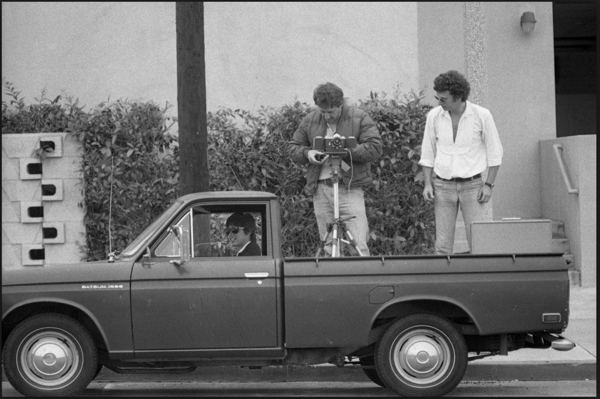
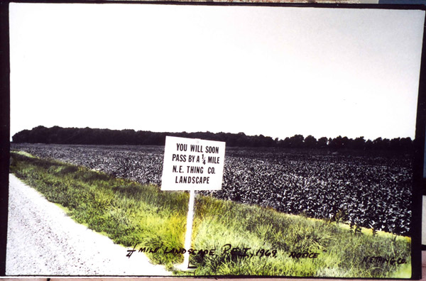

<!-- .slide: data-background-image="img/mercator.jpg" -->
<!-- .slide: class="hover"-->

## Post-_Weltbild_. Cartographier le monde après le numérique

### Enrico Agostini-Marchese    &    Christelle Proulx
 
Conférenciers invités
 
Colloque "Post-médium?" HAR6150 - Hiver 2018
 
 
Montréal - 19 avril 2018

<!-- .element: style="font-size:1.4rem" -->

 <!-- .element: class="logo" -->

%%%%%%%%%%%%%%%%%%%%%%%%%%%%%%%%%%%%%%%%%%%%%
<!-- .slide: class="hover"-->
##### Résumé du débat pour le choix du sujet

%%%%%%%%%%%%%%%%%%%%%%%%%%%%%%%%%%%%%%%%%%%%%
<!-- .slide: data-background-image="img/PLA160.GIF" data-background-size="contain"-->
<!-- .slide: class="hover"-->

## Weltbild

- Image du monde
- Vision du monde, conception du monde
- Heidegger, _Chemins qui mènent nulle part_ :
  - Essence de la modernité :  « ce qui caractérise et distingue le règne des Temps Modernes »
  - Monde : ensemble de toutes les choses qui existent
  - Image : reproduction de quelque chose
§§§§§§§§§§§§§§§§§§§§§§§§§§§§§§§§§§§§§§§§§§§§§
<!-- .slide: data-background-image="img/PLA160.GIF" data-background-size="contain" -->
<!-- .slide: class="hover"-->
## Weltbild

> « nous le tenions devant nous [le monde], en tout ce qui relève de lui, en tout ce en quoi il consiste, comme système. [...] Là où le Monde devient image conçue, la totalité de l'étant est comprise et fixée comme ce sur quoi l'homme peut s'orienter, comme ce qu'il veut par conséquent amener et avoir devant soi, aspirant ainsi à l'arrêter, dans un sens décisif, en une représentation. »

Martin Heidegger, _Chemins qui mènent nulle part_

<!-- .element: class="source" -->
§§§§§§§§§§§§§§§§§§§§§§§§§§§§§§§§§§§§§§§§§§§§§
<!-- .slide: data-background-video="video/Netarts _ Chatonsky.mp4" data-background-video-loop="loop" data-background-size="cover"-->
<!-- .slide: class="hover"-->
### Post-image-du-monde, post-numérique

- Entrelacement de l'espace tangible et de l'espace en ligne
- Post-numérique
  - Gregory Chatonsky : « après l’Internet, c’est quand le réseau nous entoure de toutes parts et constitue notre quotidienneté »
- Cartographier après le numérique :
    - Cartographier les sites internet
    - Cartographier l’internet
    - Cartographier le monde

  Source video : © Gregory Chatonsky, _Netarts_

  <!-- .element: class="source" -->
§§§§§§§§§§§§§§§§§§§§§§§§§§§§§§§§§§§§§§§§§§§§§
<!-- .slide: data-background-image="img/boettiMappe.jpg" data-background-size="contain"-->
<!-- .slide: class="hover"-->

### Trois atlas contemporains

- Martin Vargic, _Les curieuses cartes de Vargic_, 2016
- Louise Drülhe, _Critical Atlas of Internet_
- Google Street View
%%%%%%%%%%%%%%%%%%%%%%%%%%%%%%%%%%%%%%%%%%%%%
<!-- .slide: data-background-image="img/atlas.jpg" data-background-size="contain"-->
<!-- .slide: class="hover"-->
## Atlas

- XVIe siècle
- A book format that compiles and organizes geographical and astronomical knowledge
§§§§§§§§§§§§§§§§§§§§§§§§§§§§§§§§§§§§§§§§§§§§§
<!-- .slide: data-background-image="img/mercator.jpg" data-background-size="contain"-->
<!-- .slide: class="hover"-->
## Gerhard Mercator

%%%%%%%%%%%%%%%%%%%%%%%%%%%%%%%%%%%%%%%%%%%%%
<!-- .slide: data-background-image="img/vargicCouverture.jpg" data-background-size="contain"-->
<!-- .slide: class="hover"-->
## Martin Vargic, _Les curieuses cartes de Vargic. Un atlas du monde moderne_, 2016.

§§§§§§§§§§§§§§§§§§§§§§§§§§§§§§§§§§§§§§§§§§§§§
<!-- .slide: data-background-image="img/vargicInternet.jpg" data-background-size="contain"-->
<!-- .slide: class="hover"-->
§§§§§§§§§§§§§§§§§§§§§§§§§§§§§§§§§§§§§§§§§§§§§
<!-- .slide: data-background-image="img/vargicDeepWeb.jpg" data-background-size="contain"-->
<!-- .slide: class="hover"-->
§§§§§§§§§§§§§§§§§§§§§§§§§§§§§§§§§§§§§§§§§§§§§
<iframe src="https://giphy.com/embed/3oEduTny9qJEtpGElG" width="480" height="480" frameBorder="0" class="giphy-embed" allowFullScreen></iframe>
<a href="https://giphy.com/gifs/meatballs-spaghetti-eyeballs-3oEduTny9qJEtpGElG">
<data-background-size="contain"-->
<!-- .slide: class="hover"-->

%%%%%%%%%%%%%%%%%%%%%%%%%%%%%%%%%%%%%%%%%%%%%
#### Louise Drühle, _Critical atlas of Internet_, 2016.

<iframe width="1000" height="600" src="http://internet-atlas.net/" frameborder="0" allow="autoplay; encrypted-media" allowfullscreen></iframe>

§§§§§§§§§§§§§§§§§§§§§§§§§§§§§§§§§§§§§§§§§§§§§
<!-- .slide: data-background-image="atlas-formats.jpg" data-background-size="contain"-->
<!-- .slide: class="hover"-->

%%%%%%%%%%%%%%%%%%%%%%%%%%%%%%%%%%%%%%%%%%%%%
####  Google Street View

<!-- .slide: data-background-image="img/streetview.gif" data-background-size="contain"-->

§§§§§§§§§§§§§§§§§§§§§§§§§§§§§§§§§§§§§§§§§§§§§
##### Jon Rafman, _The Nine Eyes of Google Street View_, 2009-.

<iframe width="1000" height="550" src="http://9-eyes.com" frameborder="0" allow="autoplay; encrypted-media" allowfullscreen></iframe>

§§§§§§§§§§§§§§§§§§§§§§§§§§§§§§§§§§§§§§§§§§§§§
#### Ed Rusha, _Every Building on Sunset Strip_, 1966.

<!-- .slide: data-background-image="img/everybuilding.jpg" data-background-size="contain"-->
<!-- .slide: class="hover"-->

§§§§§§§§§§§§§§§§§§§§§§§§§§§§§§§§§§§§§§§§§§§§§

§§§§§§§§§§§§§§§§§§§§§§§§§§§§§§§§§§§§§§§§§§§§§
#### N.E. Thing Co., _You Will Soon Pass By_, 1969.

§§§§§§§§§§§§§§§§§§§§§§§§§§§§§§§§§§§§§§§§§§§§§
#### #googlewin

